<!-- hero: monochrome ASCII portrait (types in) beside a neofetch-style info
     panel. regenerate portrait: python scripts/prep_photo.py <photo> &&
     python scripts/make_ascii_svg.py ; info panel: python scripts/make_info_card.py -->

<!-- animated contribution graph: real data, boxes reveal cell by cell
     (regenerated daily by .github/workflows/update-profile-art.yml) -->
     
<table>
<tr>
<td valign="top"></td>
<td valign="top"></td>
</tr>
</table>

 

<b>Founder & CEO @ WebDextro Ltd • AI Engineer • Full Stack Developer • Open Source Contributor</b>

 

## About Me

I am a Web Developer and the Founder & CEO of **WebDextro Ltd**, with a relentless focus on building high-impact digital infrastructure. My work spans the full stack, from architecting robust SaaS platforms to integrating complex AI/ML pipelines that drive automation and business intelligence. I thrive on translating abstract technical challenges into high-performance, secure, and scalable products.

*   **Engineering Focus:** Distributed systems, scalable SaaS architecture, and AI-driven workflow automation.
*   **Full Stack:** Mastery of Laravel, Flutter, Vue.js, and modern cloud-native technologies.
*   **Mindset:** Open-source advocate, product-focused engineer, and continuous learner.

### Open To
*   Full-time Development & Architectural roles.
*   Open-source collaborations and technical mentoring.
*   Strategic startup partnerships and consulting.

 

 

 

 
 
 

  
 
  

 

## Technology Stack

  

 
 

<h3><code>themubiin@github ~ $ ./contributions.sh</code></h3>

 
 

---

## 🚀 Featured Projects

<b>Kajkhuji</b>

A Bangladesh-first freelancing marketplace connecting clients and freelancers through projects, gigs, secure payments, and professional collaboration.

| Attribute | Value |
| :--- | :--- |
| **Stack** | WordPress, Flutter, REST API |
| **Architecture** | Freelance Marketplace |
| **Features** | Projects, Gigs, Escrow, Wallet, Messaging, Reviews |
| **Performance** | LiteSpeed Cache, Cloudflare CDN, Optimized Database |
| **Security** | JWT Authentication, Role-Based Access, Secure Payments |
| **Deployment** | Self-Hosted + Cloudflare |
| **Status** | Active Startup |
| **Website** | https://kajkhuji.bd |

<b>WebDextro</b>

The official website of WebDextro Ltd, showcasing AI solutions, software development, automation, and digital services.

| Attribute | Value |
| :--- | :--- |
| **Stack** | Next.js, React, Tailwind CSS, TypeScript |
| **Architecture** | Static Web Application |
| **Features** | Company Profile, Services, Portfolio, Contact |
| **Performance** | SEO Optimized, Static Export |
| **Deployment** | Self-Hosted |
| **Status** | Production |
| **Website** | https://webdextro.org |

<b>GreenChat</b>

An AI-powered messaging platform focused on secure communication with modern UI and intelligent chatbot integration.

| Attribute | Value |
| :--- | :--- |
| **Stack** | Bluetooth |
| **Architecture** | Decentralized Real-time Chat |
| **Features** | Chat without Internet |
| **Performance** | Real-time Synchronization |
| **Security** | Decentralized, End-to-End Authentication |
| **Deployment** | Kotlin |
| **Status** | Live - [Try Now](https://themubiin.github.io/greenchat.app/)  |
| **Repository** | [Github](https://github.com/themubiin/GreenChat) |

<b>Win12 Experience</b>

A modern web-based Windows 12 experience recreated using React with a desktop environment, apps, and animations.

| Attribute | Value |
| :--- | :--- |
| **Stack** | React, Next.js, Tailwind CSS, TypeScript |
| **Architecture** | Single Page Application |
| **Features** | Desktop UI, Start Menu, Window System, File Explorer |
| **Performance** | Optimized Rendering & Asset Loading |
| **Deployment** | Github - [Try Now](https://themubiin.github.io/Win12/) |
| **Status** | Open Source |
| **Repository** | [@Win12](https://github.com/themubiin/Win12) |

<b>OpenRx</b>

An AI-assisted digital prescription management platform for doctors and healthcare professionals.

| Attribute | Value |
| :--- | :--- |
| **Stack** | Next.js, React, TypeScript, AI APIs |
| **Architecture** | AI SaaS Platform |
| **Features** | AI Prescription Generation, Patient Records, PDF Export |
| **Performance** | Fast Client-side Rendering |
| **Security** | Secure Authentication |
| **Deployment** | Vercel |
| **Status** | In Development |
| **Repository** | Private |

<b>Lab Test Cost</b>

A Bangladesh-focused healthcare platform that helps users compare medical laboratory test prices from different diagnostic centers.

| Attribute | Value |
| :--- | :--- |
| **Stack** | Next.js, React, TypeScript |
| **Architecture** | Healthcare Information Platform |
| **Features** | Test Price Comparison, Search, Diagnostic Directory |
| **Performance** | SEO Optimized |
| **Deployment** | Netlify |
| **Status** | Live - [Try Now](https://lab-test-cost.netlify.app/) |
| **Repository** | Private |

---

## 🧑🏻‍💼 Professional Experience

### Founder & CEO
**WebDextro Ltd** | *2024 - Present*

*   Leading the development of enterprise-grade SaaS solutions (AmarCareer, Foodiez, etc.).
*   Architected scalable backend infrastructure and automated deployment pipelines.
*   Mentoring a cross-functional team of developers to deliver high-quality code.
*   **Technologies:** PHP, Laravel, Flutter, AWS, Docker, AI/ML Integrations.

---

## 🏅 Certifications

     
 
 
 

---
